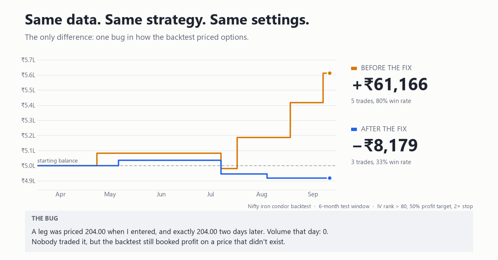
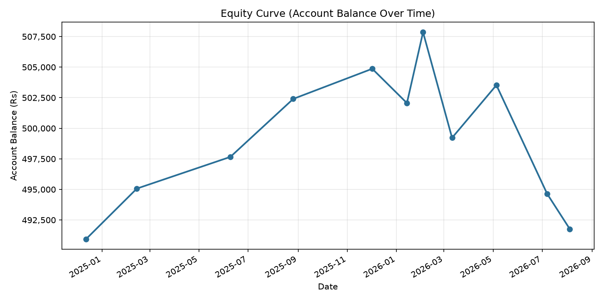

# Nifty Iron Condor Backtest

A backtesting project for a systematic options-selling strategy on Nifty index options: sell an iron condor when implied volatility is unusually high relative to its own recent history.

The stack is a Python data pipeline, a Rust backtest loop exposed through PyO3, a FastAPI backend and a React dashboard, all running on free NSE end-of-day data. It is a research prototype. No real money or broker connection is involved.



## Headline result

24 months of NSE data (Sep 2024 - Sep 2026), fixed settings, no re-tuning:

| Metric | Value |
|---|---|
| Trades | 11 |
| Win rate | 54.5% (6 wins, 5 losses) |
| Total return | -1.65% |
| Sharpe ratio (per trade, not annualized) | -0.13 |
| Max drawdown | -3.17% |
| Profit factor | 0.74 |



This is not a profitable strategy yet, and 11 trades is far too few to claim an edge. What the project does establish is that the backtest itself can be trusted, which is the reason the bug below matters.

## The bug that made the first results wrong

An early run on a 6-month test window showed an 80% win rate (+Rs 61,166). Auditing the trade log by hand showed why: NSE's bhavcopy lists a "close" price for every contract, including contracts nobody traded that day, where the price is just the last one carried forward. The backtest used those frozen prices as if they were tradeable, so it could "buy back" a leg at a price that never existed and book profit on it.

One leg, for example, was priced 204.00 at entry and exactly 204.00 two days later, with volume 0 on the second day.

**Fix:** a leg's price is only trusted if the contract actually traded that day (`min_volume`, default 1). Otherwise it is treated as missing, exactly like a price that wasn't available. See `option_lookup.py` (Python) and `liquid_price()` in `nifty_backtest_rs/src/lib.rs` (Rust).

Same data and settings, before and after:

| | Trades | Win rate | P&L |
|---|---|---|---|
| Before fix | 5 | 80% | +Rs 61,166 |
| After fix | 3 | 33% | -Rs 8,179 |

**Second bug, found while cross-checking the two engines:** the Python and Rust versions disagreed on one trade. Two strikes were equally close to the target, and Rust's `HashSet` has no defined iteration order, so it could pick a different one. Strike lists are now sorted in both engines.

**The same bug, missed once:** the expiry list had the identical problem. On 2025-09-24 two expiries were both exactly 4 days from the 30-day target, so the Rust engine picked one at random per process, and identical reruns gave 12 trades or 11 trades. The first 24-month numbers I published came from the lucky branch. Expiries are now sorted too; Rust and Python agree and 8 of 8 fresh runs gave the same result (11 trades, Rs 4,91,765).

## The strategy

- **Signal:** each day, compute Nifty's at-the-money implied volatility, then its IV Rank over a 20-day lookback. Enter when IV Rank crosses above 80 (a fresh cross, not just "is above").
- **Trade:** sell an iron condor. Short call and put are placed 3% out-of-the-money, and the long hedges are 200 points further out. The expiry is chosen around 30 days out.
- **Exits, whichever comes first:**
  - profit target: 50% of the credit received
  - stop-loss: loss reaches 2x the credit received
  - forced exit at expiry, settled by intrinsic value against spot
- **Sizing:** one position at a time, a lot size of 75, and an imaginary Rs 5,00,000 account.

Implied volatility is not published historically by NSE, so it is computed from each option's closing price with Black-Scholes (`clean_and_iv.py`). Roughly 15-25% of rows end up with no IV, mostly deep in-the-money options near expiry where the closing price and index close are inconsistent. That is a normal quirk of free end-of-day data.

## Caveats

- The settings (IV threshold 80, profit target 50%) were picked from a grid search on the 4-month tuning window, run *before* the liquidity fix. Re-running that grid on the fixed engine still ranks 80% / 50% first, but every combination loses money on that window (best: 3 trades, -Rs 5,648). The 24-month run overlaps that window, so treat it as a verification of a fixed rule set, not a pure out-of-sample test.
- The Rust engine is not faster here. On the 24-month data the pure Python engine finishes in under a second, while the Rust path takes about 3.7 s end to end because converting ~800k rows into lists for PyO3 dominates. A speedup would only show with data converted once and many parameter sweeps, which I have not measured.
- Trades are priced at the daily close. Real fills, slippage and brokerage are not modelled.
- The dashboard (`frontend/` + `api.py`) currently shows the 10-month tuning/test split. The 24-month results live in `results_24m.xlsx`.

## Project structure

| File | What it does |
|---|---|
| `download_bhavcopy.py` | Downloads NSE's daily derivatives bhavcopy into `raw_data/` |
| `clean_and_iv.py` | Filters to Nifty index options, cleans rows, computes IV |
| `split_and_save.py`, `run_pipeline.py` | 10-month download, cleaned data, 4-month tuning / 6-month test split |
| `build_full_dataset.py` | Builds the single 24-month dataset (`data_24m.csv`) |
| `iv_rank.py` | ATM IV series, IV Rank and IV Percentile |
| `strategy_config.py` | All entry/exit thresholds in one place |
| `option_lookup.py` | Fast price lookups, with the volume filter |
| `iron_condor_backtest.py`, `account_backtest.py` | Python engine (reference implementation) |
| `nifty_backtest_rs/`, `rust_bridge.py` | Rust engine via PyO3, cross-checked against the Python one |
| `grid_search.py`, `evaluate_on_test.py` | Tuning grid and the one-time test evaluation |
| `run_24m_backtest.py` | Full 24-month run, writes `results_24m.xlsx` and charts |
| `performance_report.py`, `export_excel.py` | Metrics, charts and Excel export |
| `api.py`, `frontend/` | FastAPI backend and React dashboard |
| `make_before_after_chart.py` | Builds the before/after image above |

## Running it

```bash
python -m venv .venv
.venv\Scripts\activate            # Windows
pip install -r requirements.txt
pip install maturin
cd nifty_backtest_rs && maturin develop --release && cd ..
```

**Quick start with the committed data** (no download needed):

```python
import pandas as pd
from rust_bridge import run_account_backtest_rust
from run_24m_backtest import build_config

df = pd.read_csv("data_24m.csv", parse_dates=["date", "expiry"])
trade_log, final_balance = run_account_backtest_rust(df, build_config(), 500_000, 75)
print(trade_log)
```

**Rebuild everything from scratch** (downloads several GB of raw NSE files into `raw_data/`, which is gitignored):

```bash
python -c "from datetime import date, timedelta; from download_bhavcopy import download_range; e = date.today() - timedelta(days=1); download_range(e - timedelta(days=720), e)"
python run_24m_backtest.py
```

**Dashboard:**

```bash
uvicorn api:app --reload          # terminal 1
cd frontend && npm install && npm run dev   # terminal 2
```

See `README_RUST.md` for the PyO3/maturin setup in more detail.

## Some finance terms

- **Iron condor:** sell an out-of-the-money call and put, and buy a further out-of-the-money call and put as hedges. You collect a credit up front and profit if Nifty stays inside the short strikes. The hedges cap the maximum loss.
- **Implied volatility (IV):** the market's guess of how much Nifty will move, backed out of option prices.
- **IV Rank:** where today's IV sits between the lowest and highest IV of the lookback window, from 0 to 100.
- **Profit factor:** total rupees won divided by total rupees lost. Below 1 means more was lost than won.
- **Bhavcopy:** NSE's free official end-of-day trade report.
